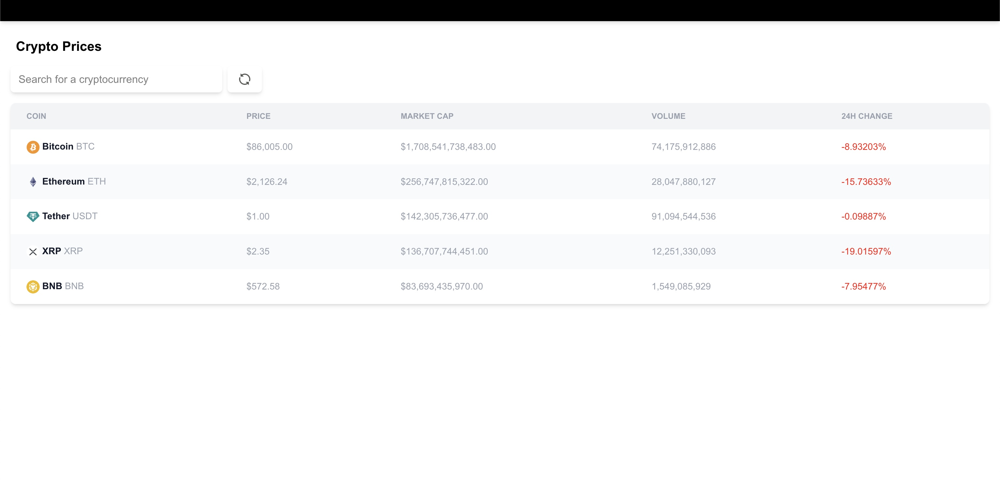

# 🚀 Crypto Tracker

A minimalistic and efficient **Crypto Tracker** application built with **Next.js** and **React Query**, designed to track five cryptocurrencies with filtering and refreshing capabilities.

## ✨ Features

- 🔍 **Search & Filter**: Quickly find your desired cryptocurrency from the displayed list.
- 🔄 **Refresh Data**: Re-query the latest prices from the **CoinGecko API** with a single click.
- ⚡ **Fast & Cached API Calls**: Implemented with **React Query** for optimized performance and caching.
- 🌐 **Custom API Route**: Fetches data via `api/prices` in Next.js for structured API handling.

## 🛠️ Tech Stack

- **Next.js** – Server-side rendering & API handling.
- **React Query** – Efficient data fetching and caching.
- **CoinGecko API** – Real-time cryptocurrency price data.

## 📦 Installation & Usage

1. Clone the repository:
   ```sh
   git clone https://github.com/yourusername/crypto-tracker.git
   cd crypto-tracker
   ```

2. Install dependencies:
   ```sh
   npm install  # or yarn install
   ```

3. Start the development server:
   ```sh
   npm run dev  # or yarn dev
   ```

4. Open your browser and visit:
   ```
   http://localhost:3000
   ```

## 📡 API Route

This app leverages a custom API route in Next.js to fetch cryptocurrency prices:
```sh
/api/prices
```
This route queries the **CoinGecko API**, ensuring modularity and control over data retrieval.

## 🎨 UI Preview




💡 *Contributions are welcome! Feel free to open issues and PRs.* 🚀

